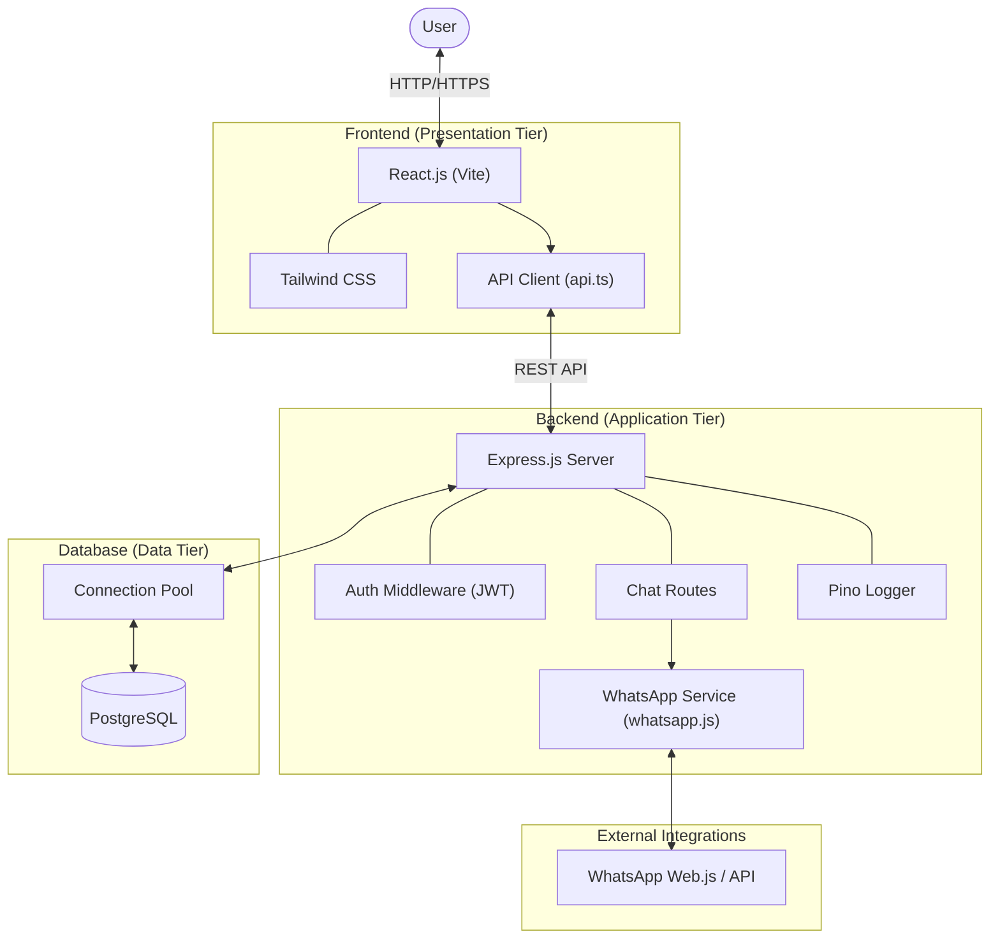

# Project Architecture: Chatbot

This document provides a high-level overview of the Chatbot project's architecture, illustrating the relationship between the frontend, backend, database, and external integrations.

## Architecture Diagram

## Component Breakdown

### 1. Frontend (Presentation Tier)
- **React.js & Vite**: A modern frontend framework and build tool for a fast, responsive user interface.
- **Tailwind CSS**: Utility-first CSS framework for efficient and consistent styling.
- **API Client**: Centralized logic for interacting with the backend API.

### 2. Backend (Application Tier)
- **Express.js**: A flexible Node.js web application framework that handles routing and middleware.
- **Auth Middleware**: Manages authentication and authorization using JSON Web Tokens (JWT).
- **WhatsApp Service**: Encapsulates the logic for interacting with external WhatsApp APIs or libraries.
- **Pino Logger**: High-performance logging for debugging and monitoring.

### 3. Database (Data Tier)
- **PostgreSQL**: A powerful, open-source relational database for persistent storage.
- **Connection Pool**: Manages a pool of database connections to optimize performance and resource usage.

### 4. External Integrations
- **WhatsApp**: Integration with WhatsApp services to facilitate communication through the chatbot.
